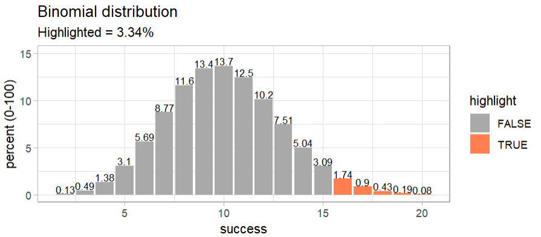

[](https://cran.r-project.org/package=tidydice)
[](https://cran.r-project.org/package=tidydice)
[](https://cran.r-project.org/package=tidydice)

# tidydice
Simulates Dice Rolls and Coin Flips.

### Introduction

A basic understanding of probability and statistics is crucial for data understanding. A great way to teach probability and statistics is to start with an experiment, like rolling a dice or flipping a coin.

This package simulates rolling a dice and flipping a coin. Each experiment generates a tibble. Dice rolls and coin flips are simulated using sample(). The properties of the dice can be changed, like the number of sides. A coin flip is simulated using a two sided dice. Experiments can be combined with the pipe-operator.

## Installation

### CRAN
```r
install.packages("tidydice")
```

### DEV version (github)
```r
# install from github
if (!require(devtools)) install.packages("devtools")
devtools::install_github("rolkra/tidydice")
```
if you are behind a firewall, you may want to:

* Download and unzip the tidydice package
* Then install it with devtools::install_local

```r
# install local
if (!require(devtools)) install.packages("devtools")
devtools::install_local(path = <path of local package>, force = TRUE)
```

## Basic example

Let's roll 60 dice:

```r
# load packages
library(tidydice)

# roll 60 dice (10 x 6 dice = 60)
roll_dice(times = 10, rounds = 6) |> 
  plot(dice)
```


We got 13 six. Is this unlikely? The expected value is 10 (60 dice / 6 sides = 10).  So 13 is more than expected, is it a sign of cheating? Let's check using the binomial ditribution:

```r
# binomial distribution
binom_dice(times = 60) |> 
  plot_binom(highlight = c(13:60))
```


The binomial distribution shows, that there is a 19% chance that you can get 13 or more six using a fair dice.

## Roll dice

```r
# load packages
library(tidydice)

# roll a dice
roll_dice()

# roll a dice 6x
roll_dice(times = 6)

# roll a dice 6x and plot result
roll_dice(times = 6) |> 
  plot_dice()

# repeat 6x
roll_dice(times = 6, rounds = 6)  |>  
  plot_dice()

# count success per round
roll_dice(times = 6, rounds = 6, agg = TRUE)

# Binomial distribution
binom_dice(times = 6)
  
# Binomial distribution + plot
binom_dice(times = 6) |>  
  plot_binom()

# Binomial distribution + plot 
binom_dice(times = 6) |>  
  plot_binom(highlight = 0:2)
```

## Roll dice (advanced)

To do more complex dice rolls use ```roll_dice_formula()```:

```r
library(tidydice)

roll_dice_formula(
  dice_formula = "4d6e3", # 4 dice with 6 sides, explode on a 3
  rounds = 5,             # repeat 5 times
  success = 15:24,        # success is defined as sum between 15 and 24
  seed = 123              # random seed to make it reproducible
)
```

- ```1d6``` = roll one 6-sided dice
- ```1d8``` = roll one 8-sided dice
- ```1d12``` = roll one 12-sided dice
- ```2d6``` = roll two 6-sided dice
- ```1d6e6``` = roll one 6-sided dice, explode dice on a 6
- ```3d6kh2``` = roll three 6-sided dice, keep highest 2 rolls
- ```3d6kl2``` = roll three 6-sided dice, keep lowest 2 rolls
- ```4d6kh3e6``` = roll four 6-sided dice, keep highest 3 rolls, but explode on a 6
- ```1d20+4``` = roll one 20-sided dice, and add 4
- ```1d4+1d6``` = roll one 4-sided dice and one 6-sided dice, and sum the results

## Flip coin

```r
# load packages
library(tidydice)

# flip a coin
flip_coin()

# flip a coin 10x
flip_coin(times = 10)

# flip a coin 10x and plot result
flip_coin(times = 10) |> 
  plot_coin()

# repeat 10x and plot result
flip_coin(times = 10, rounds = 10) |> 
  plot_coin()

# count success per round
flip_coin(times = 10, rounds = 10, agg = TRUE)

# Binomial distribution
binom_coin(times = 10)
  
# Binomial distribution + plot
binom_coin(times = 10) |>  
  plot_binom()

# Binomial distribution + plot 
binom_coin(times = 10) |>  
  plot_binom(highlight = 0:2)
```
